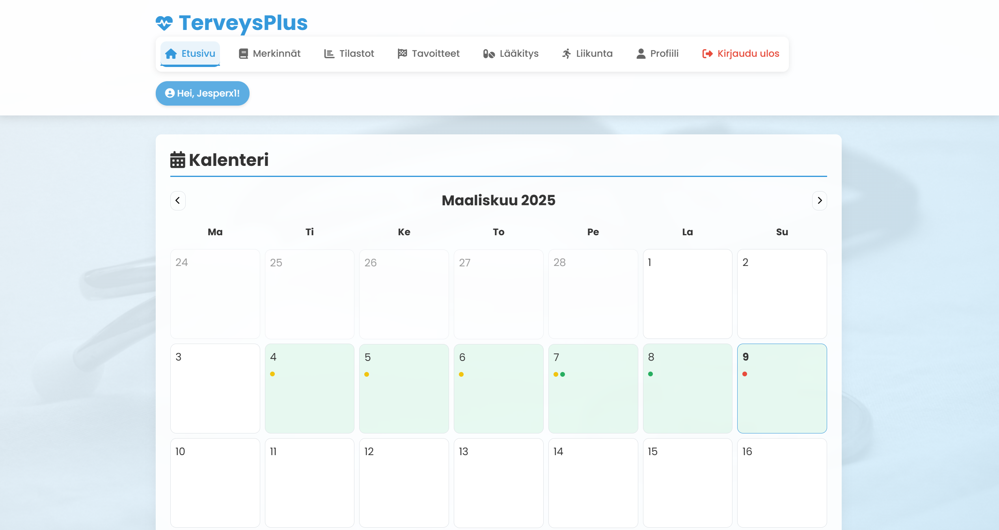
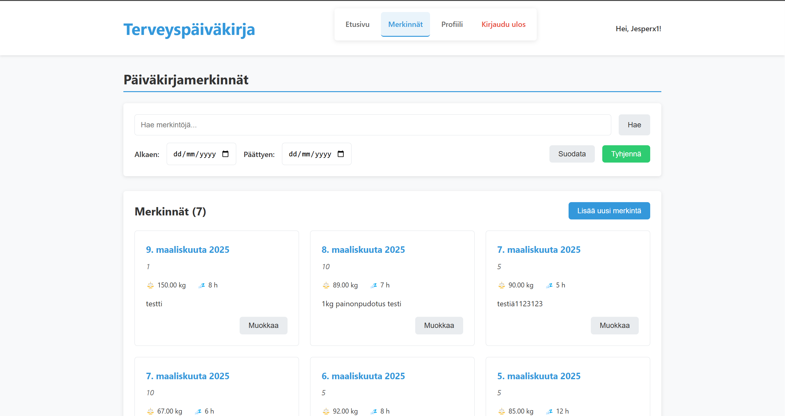
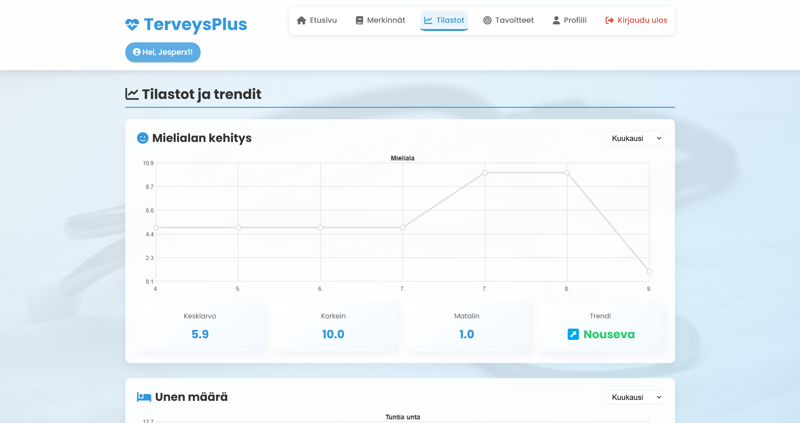
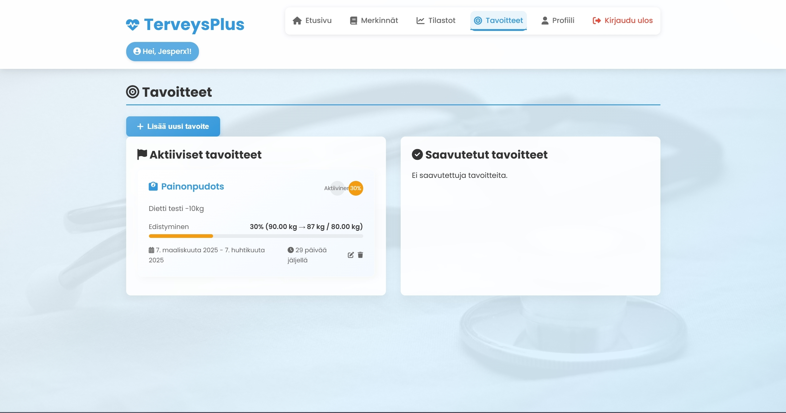
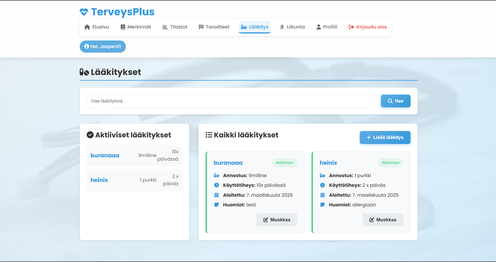
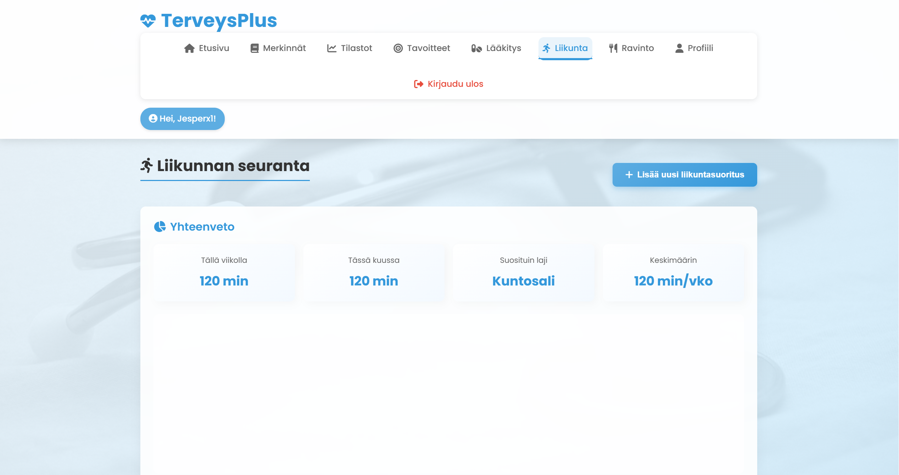
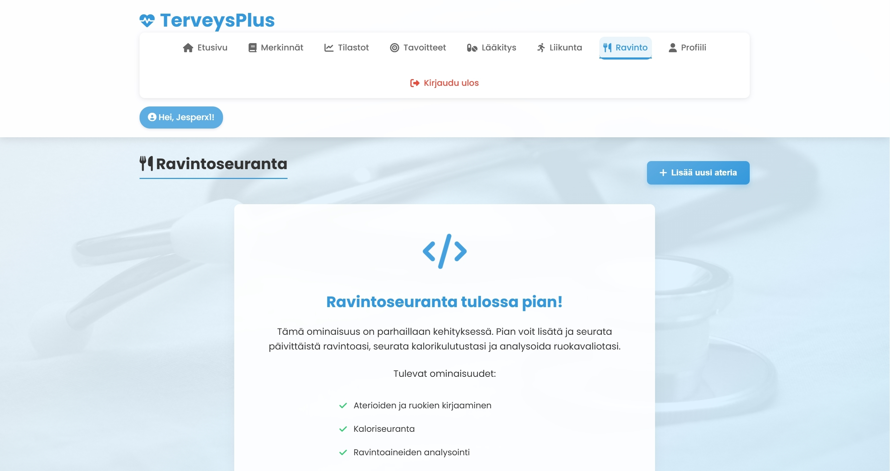
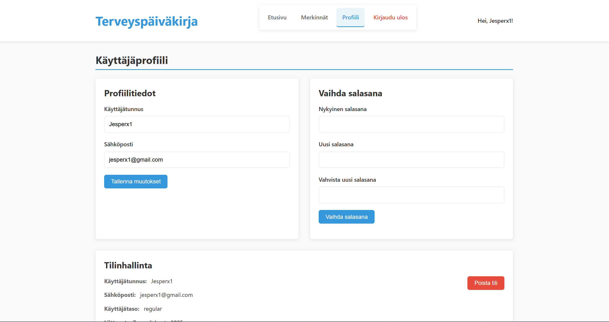

# TerveysPlus - Personal Health Diary Application

TerveysPlus is a comprehensive personal health tracking application that allows users to monitor various aspects of their wellbeing including daily mood, weight, sleep patterns, medications, and exercise activities. The application provides intuitive visualizations and trends analysis to help users understand their health journey better.

## Screenshots

### Dashboard

### Diary Entries

### Statistics

### Goals Tracking

### Medications Management

### Exercise Tracking

### Nutrition

### Profile

## Links

- **Frontend:** [http://localhost:3000](http://localhost:3000)
- **Backend API:** [http://localhost:3000/api](http://localhost:3000/api)
- **API Documentation:** [API Documentation](apidoc.md)

## Database Description

The application uses a MySQL database named `HealthDiary` with the following tables:

### Users
Stores user account information:
- `user_id` (Primary Key)
- `username`
- `password` (hashed)
- `email`
- `created_at`
- `user_level` (regular/admin)

### DiaryEntries
Stores daily health diary entries:
- `entry_id` (Primary Key)
- `user_id` (Foreign Key)
- `entry_date`
- `mood`
- `weight`
- `sleep_hours`
- `notes`
- `created_at`

### Medications
Tracks user medications:
- `medication_id` (Primary Key)
- `user_id` (Foreign Key)
- `name`
- `dosage`
- `frequency`
- `start_date`
- `end_date`
- `notes`
- `created_at`
- `updated_at`

### Exercises
Records exercise activities:
- `exercise_id` (Primary Key)
- `user_id` (Foreign Key)
- `type`
- `duration`
- `intensity`
- `date`

### Goals
Stores health-related goals:
- `goal_id` (Primary Key)
- `user_id` (Foreign Key)
- `title`
- `type`
- `description`
- `start_date`
- `end_date`
- `target_value`
- `start_value`
- `target_direction`
- `unit`
- `completed`
- `completed_date`

## Features and Functionality

### Authentication
- User registration with email validation
- Secure login with JWT token authentication
- Password hashing with bcrypt
- User profile management

### Dashboard
- Calendar overview with color-coded diary entries
- Quick entry form for daily health metrics
- Recent entries display
- Summary statistics (average mood, sleep, latest weight)

### Diary Entries
- Add, edit, and delete health diary entries
- Record daily mood (0-10 scale)
- Track weight and sleep hours
- Add personal notes
- Filter entries by date range and keywords
- Pagination for better organization

### Statistics and Trends
- Visualizations for mood, sleep, and weight trends
- Customizable time periods (week, month, 3 months, year)
- Statistical analysis (averages, max/min values, trends)
- Monthly summary view

### Goals Tracking
- Create and manage health-related goals
- Different goal types (weight, sleep, mood, custom)
- Progress tracking with visual indicators
- Goal completion tracking

### Medications Management
- Track prescribed and over-the-counter medications
- Record dosage, frequency, and duration
- Active medications overview
- Start and end dates tracking
- Search functionality

### Exercise Tracking
- Log different types of exercises
- Record duration and intensity
- Exercise calendar
- Exercise statistics and summary
- Favorite exercise types analysis

### Responsive UI
- Mobile-friendly design with dedicated mobile navigation
- Clean, modern interface with intuitive controls
- Color-coded indicators for better visual tracking
- Interactive charts and progress indicators

## Known Issues
- Mobile navigation might have some usability issues.
- Exercise tracking feature is currently using localStorage instead of full backend integration.
- Nutrition section is not fully implemented yet.
- Navigation bar does not show every tab in every section. (could be improved.)

### Technologies Used
- **Frontend:** HTML5, CSS3, JavaScript (ES6+)
- **Backend:** Node.js, Express.js
- **Database:** MySQL
- **Authentication:** JWT (JSON Web Tokens), bcrypt
- **API Validation:** express-validator

### External Libraries
- Font Awesome for icons
- Poppins Google Font for typography
- Unsplash for background images

### Tutorials and Resources
- MDN Web Docs
- W3Schools
- Stack Overflow
- Node.js Documentation
- Express.js Documentation
- MySQL Documentation
- Claude
- Chatgpt
- Youtube

### Ohjelmistotestaus - yksilötehtävät
Tehtävä 1

Asensin koneelleni seuraavat työkalut =
- Robot Framework
- Browser Library
- Requests library
- CryptoLibrary
- Robotidy

Tehtävä 

